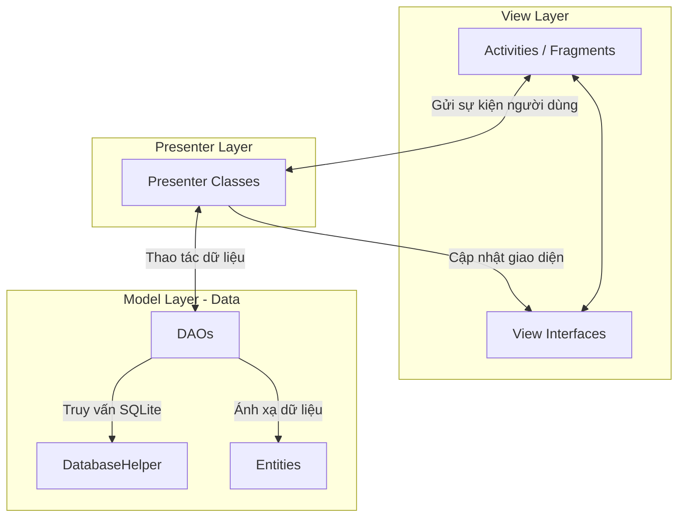
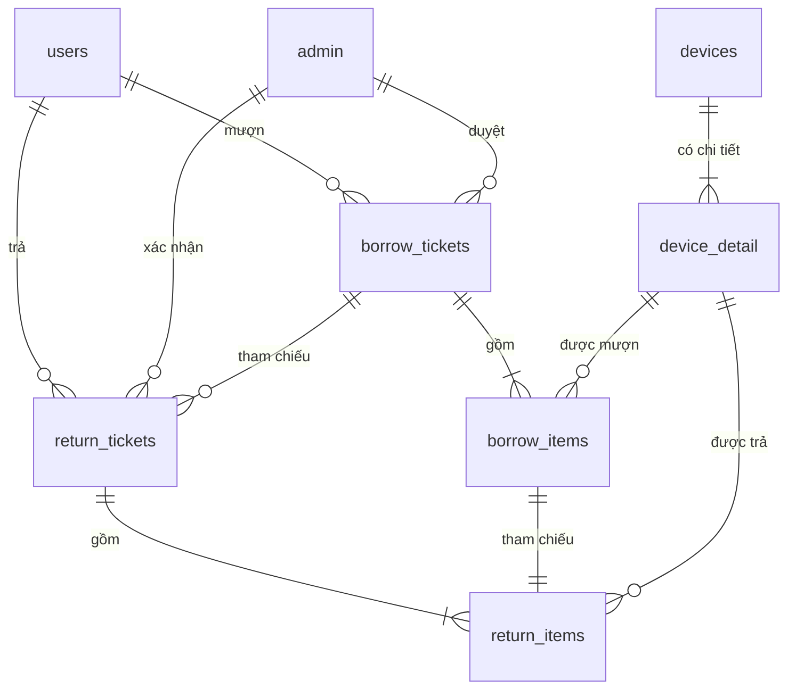
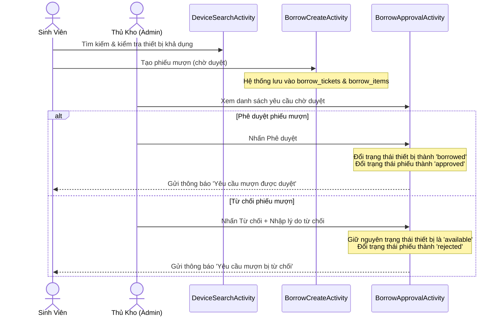

# HaUI Device Management System (Hệ thống Quản lý Thiết bị HaUI)

Chào mừng bạn đến với **HaUI Device Management System** — ứng dụng Android quản lý thiết bị học tập và giảng dạy tại trường Đại học Công nghiệp Hà Nội (HaUI). Dự án được phát triển bằng ngôn ngữ **Java**, sử dụng kiến trúc **MVP (Model-View-Presenter)** và cơ sở dữ liệu **SQLite**.

---

## 🗺️ 1. Kiến trúc Dự án (Architecture)

Dự án tuân thủ mô hình kiến trúc **MVP (Model-View-Presenter)** để phân chia rõ ràng các lớp trách nhiệm, giúp mã nguồn dễ bảo trì và mở rộng:

### Chi tiết các tầng trong dự án:

* **Model (`com.haui.devicemanagement.data`)**:
  * **`entity/`**: Chứa các thực thể dữ liệu biểu diễn các thực thể trong CSDL (như `User`, `Admin`, `Device`, `BorrowTicket`,...).
  * **`dao/`**: Data Access Objects — các lớp đóng gói toàn bộ logic truy vấn dữ liệu từ SQLite (như `UserDao`, `DeviceDao`,...).
  * **`DatabaseHelper.java`**: Lớp kế thừa `SQLiteOpenHelper`, chịu trách nhiệm tạo cấu trúc 9 bảng, nâng cấp phiên bản và nạp dữ liệu mẫu (Seed Data).

* **View (`com.haui.devicemanagement.view`)**:
  * Chứa các UI components gồm: `Activity`, `Fragment` và `Adapter`.
  * Mỗi Activity/Fragment quan trọng đều định nghĩa một interface (View Interface) để Presenter gọi cập nhật UI.
  * Chia làm 3 thư mục con: `auth` (xác thực), `admin` (cho quản trị viên), `user` (cho sinh viên/người dùng).

* **Presenter (`com.haui.devicemanagement.presenter`)**:
  * Lớp trung gian chứa toàn bộ logic nghiệp vụ (Business Logic).
  * Nhận các sự kiện tương tác từ View, truy vấn dữ liệu thông qua các DAO và quyết định hiển thị gì lên View.
  * Giúp View hoàn toàn không chứa logic nghiệp vụ hay logic CSDL phức tạp.

* **Utility (`com.haui.devicemanagement.util`)**:
  * Các tiện ích dùng chung như: `SessionManager` (quản lý phiên đăng nhập qua SharedPreferences), `PasswordUtils` (mã hóa mật khẩu), `DateUtils` (định dạng ngày tháng), `Constants` (định nghĩa hằng số),...

---

## 🗄️ 2. Cơ sở Dữ liệu (Database Schema)

Hệ thống sử dụng SQLite làm CSDL cục bộ (`haui_device_management.db`) gồm **9 bảng** được thiết lập quan hệ khóa ngoại chặt chẽ (`PRAGMA foreign_keys = ON;`).

### Sơ đồ Quan hệ Thực thể (ERD)

### Chi tiết các bảng CSDL:

🔑 1. Bảng <code>users</code> (Người dùng/Sinh viên)

Lưu thông tin tài khoản sinh viên/người dùng mượn thiết bị.
* `id` (INTEGER, Primary Key, Auto Increment)
* `mssv` (TEXT, UNIQUE, Not Null) — Mã số sinh viên làm tên đăng nhập.
* `full_name` (TEXT, Not Null)
* `password_hash` (TEXT, Not Null)
* `phone` (TEXT), `email` (TEXT)
* `class_name` (TEXT) — Lớp học.
* `faculty` (TEXT) — Khoa đào tạo.
* `is_active` (INTEGER, Default 1) — Trạng thái hoạt động.
* `created_at` (TEXT)

🛡️ 2. Bảng <code>admin</code> (Quản trị viên/Cán bộ)

Lưu thông tin tài khoản cán bộ quản lý kho thiết bị.
* `id` (INTEGER, Primary Key, Auto Increment)
* `admin_code` (TEXT, UNIQUE, Not Null) — Mã cán bộ.
* `full_name` (TEXT, Not Null)
* `email` (TEXT, UNIQUE, Not Null)
* `password_hash` (TEXT, Not Null)
* `phone` (TEXT)
* `permission_level` (TEXT, Default 'staff') — Phân quyền ('staff', 'manager').
* `is_active` (INTEGER, Default 1)
* `created_at` (TEXT)

📦 3. Bảng <code>devices</code> (Danh mục thiết bị)

Lưu danh mục loại thiết bị chung.
* `id` (INTEGER, Primary Key, Auto Increment)
* `device_code` (TEXT, UNIQUE, Not Null) — Mã loại thiết bị (Ví dụ: `LAPTOP_DELL`).
* `device_name` (TEXT, Not Null) — Tên thiết bị.
* `category` (TEXT), `brand` (TEXT), `model` (TEXT)
* `description` (TEXT)
* `created_at` (TEXT)

🔍 4. Bảng <code>device_detail</code> (Chi tiết thiết bị cá biệt)

Lưu thông tin từng thiết bị cụ thể trong kho (theo Serial/Mã tài sản).
* `id` (INTEGER, Primary Key, Auto Increment)
* `device_id` (INTEGER, Foreign Key -> `devices.id` ON DELETE CASCADE)
* `asset_code` (TEXT, UNIQUE, Not Null) — Mã tài sản nội bộ.
* `serial_number` (TEXT, UNIQUE) — Số Serial của nhà sản xuất.
* `room_location` (TEXT) — Vị trí lưu kho.
* `condition_status` (TEXT, Default 'good') — Tình trạng vật lý ('good', 'fair', 'damaged').
* `availability_status` (TEXT, Default 'available') — Trạng thái mượn ('available', 'borrowed', 'maintenance').
* `purchase_date` (TEXT)
* `note` (TEXT)

📝 5. Bảng <code>borrow_tickets</code> (Phiếu đăng ký mượn)

Thông tin tổng quát của một lần đăng ký mượn thiết bị.
* `id` (INTEGER, Primary Key, Auto Increment)
* `ticket_code` (TEXT, UNIQUE, Not Null) — Mã phiếu mượn sinh tự động.
* `user_id` (INTEGER, Foreign Key -> `users.id`)
* `status` (TEXT, Default 'pending') — Trạng thái phiếu ('pending', 'approved', 'rejected', 'returned', 'overdue').
* `borrow_reason` (TEXT) — Lý do mượn.
* `expected_return_date` (TEXT) — Ngày dự kiến trả.
* `approved_by` (INTEGER, Foreign Key -> `admin.id`) — Cán bộ phê duyệt.
* `approved_at` (TEXT) — Thời điểm duyệt.
* `created_at` (TEXT) — Ngày tạo phiếu.
* `admin_note` (TEXT) — Ghi chú của thủ kho.

📎 6. Bảng <code>borrow_items</code> (Chi tiết thiết bị mượn)

Liên kết thiết bị cụ thể với phiếu mượn.
* `id` (INTEGER, Primary Key, Auto Increment)
* `ticket_id` (INTEGER, Foreign Key -> `borrow_tickets.id` ON DELETE CASCADE)
* `device_detail_id` (INTEGER, Foreign Key -> `device_detail.id`)
* `condition_out` (TEXT) — Tình trạng khi bàn giao.
* `accessories_out` (TEXT) — Phụ kiện kèm theo khi bàn giao.
* `note` (TEXT)

🔄 7. Bảng <code>return_tickets</code> (Phiếu trả thiết bị)

Thông tin tổng quát của một lần yêu cầu trả thiết bị.
* `id` (INTEGER, Primary Key, Auto Increment)
* `ticket_code` (TEXT, UNIQUE, Not Null) — Mã phiếu trả sinh tự động.
* `borrow_ticket_id` (INTEGER, Foreign Key -> `borrow_tickets.id`)
* `user_id` (INTEGER, Foreign Key -> `users.id`)
* `status` (TEXT, Default 'pending') — Trạng thái phê duyệt trả ('pending', 'confirmed').
* `returned_at` (TEXT) — Ngày giờ sinh viên trả máy.
* `confirmed_by` (INTEGER, Foreign Key -> `admin.id`) — Cán bộ nhận máy và xác nhận.
* `confirmed_at` (TEXT)
* `overall_condition` (TEXT)
* `note` (TEXT)

🔧 8. Bảng <code>return_items</code> (Chi tiết thiết bị trả)

Thông tin kiểm tra hao mòn và đền bù của từng thiết bị được trả.
* `id` (INTEGER, Primary Key, Auto Increment)
* `return_ticket_id` (INTEGER, Foreign Key -> `return_tickets.id` ON DELETE CASCADE)
* `borrow_item_id` (INTEGER, Foreign Key -> `borrow_items.id`)
* `device_detail_id` (INTEGER, Foreign Key -> `device_detail.id`)
* `condition_in` (TEXT) — Tình trạng thiết bị khi nhận lại ('good', 'fair', 'damaged', 'lost').
* `accessories_in` (TEXT) — Phụ kiện nhận lại.
* `damage_note` (TEXT) — Ghi nhận lỗi hỏng (nếu có).
* `penalty_amount` (INTEGER, Default 0) — Số tiền phạt đền bù (nếu có hỏng/mất).
* `is_completed` (INTEGER, Default 0) — Trạng thái hoàn thành xử lý.

🔔 9. Bảng <code>notifications</code> (Thông báo hệ thống)

Log lưu trữ thông báo gửi đến sinh viên và cán bộ quản lý.
* `id` (INTEGER, Primary Key, Auto Increment)
* `receiver_type` (TEXT, Not Null) — Đối tượng nhận ('user', 'admin').
* `receiver_id` (INTEGER, Not Null) — ID người nhận tương ứng.
* `type` (TEXT) — Loại thông báo ('borrow_approved', 'overdue_alert',...).
* `title` (TEXT), `message` (TEXT)
* `ref_id` (INTEGER) — ID tham chiếu (ví dụ: ticket_id).
* `ref_type` (TEXT) — Loại tham chiếu ('borrow', 'return').
* `is_read` (INTEGER, Default 0)
* `created_at` (TEXT)

---

## 📦 3. Các Phân Hệ & Màn Hình (Modules & Screens)

Hệ thống được chia thành 3 phân hệ chính:

### 🔐 A. Phân hệ Xác thực (Auth)
* **`LoginActivity`**: Màn hình đăng nhập dùng chung. Tự động chuyển hướng đến màn hình chính tương ứng dựa trên vai trò tài khoản (User/Admin).
* **`ChangePasswordActivity`**: Hỗ trợ đổi mật khẩu cho người dùng và cán bộ quản lý sau khi đăng nhập thành công.

### 🛡️ B. Phân hệ Quản trị (Admin Module)
* **`AdminDashboardActivity`**: Bảng điều khiển trực quan thống kê tổng số thiết bị, thiết bị đang cho mượn, yêu cầu mượn/trả đang chờ duyệt và thiết bị quá hạn.
* **`UserManageActivity`**: Quản lý danh sách sinh viên (Thêm mới, sửa thông tin, khóa/mở khóa tài khoản).
* **`DeviceManageActivity`**: Quản lý danh mục loại thiết bị chung.
* **`DeviceDetailManageActivity`**: Quản lý chi tiết danh sách từng thiết bị cá biệt trong kho, cập nhật trạng thái khả dụng và vị trí phòng kho.
* **`BorrowApprovalActivity`**: Xem danh sách phiếu mượn đang chờ duyệt. Hỗ trợ phê duyệt hoặc từ chối kèm lý do.
* **`ReturnApprovalActivity`**: Xem danh sách phiếu trả chờ duyệt.
* **`ReturnDetailCheckActivity`**: Màn hình dành cho thủ kho để kiểm tra vật lý thiết bị khi nhận lại (đánh giá tình trạng, ghi nhận phụ kiện, nhập tiền phạt đền bù nếu làm hỏng/mất).
* **`AssignDeviceActivity`**: Hỗ trợ thủ kho cấp phát/bàn giao thiết bị trực tiếp cho một sinh viên mà không cần sinh viên gửi yêu cầu trực tuyến.
* **`OverdueActivity`**: Danh sách theo dõi các phiếu mượn quá thời hạn trả dự kiến để gửi cảnh báo.
* **`ReportActivity`**: Xuất báo cáo thống kê dạng số liệu về tần suất mượn trả thiết bị.
* **`AdminManageActivity`**: Quản lý danh sách các tài khoản thủ kho khác (chỉ dành cho tài khoản có quyền `manager`).

### 🎓 C. Phân hệ Sinh viên (User Module)
* **`UserHomeActivity`**: Màn hình chính của sinh viên, hiển thị thông tin cá nhân tóm tắt, số lượng thiết bị đang mượn và các lối tắt chức năng nhanh.
* **`DeviceSearchActivity`**: Giao diện tìm kiếm, lọc danh mục thiết bị và kiểm tra số lượng thiết bị khả dụng trong kho để đăng ký mượn.
* **`BorrowCreateActivity`**: Giao diện tạo phiếu đăng ký mượn (chọn danh sách thiết bị cần mượn, nhập lý do mượn, chọn ngày dự kiến trả).
* **`ReturnCreateActivity`**: Chọn phiếu mượn đang giữ để tạo yêu cầu trả thiết bị.
* **`MyBorrowActivity` / `MyReturnActivity`**: Danh sách lịch sử các phiếu mượn và phiếu trả của riêng cá nhân sinh viên đó.
* **`TicketDetailActivity`**: Xem chi tiết trạng thái phê duyệt và thông tin bàn giao/hoàn trả của một phiếu cụ thể.
* **`UserProfileActivity`**: Xem thông tin hồ sơ cá nhân và cập nhật thông tin liên lạc (số điện thoại, email).

---

## 🔄 4. Luồng Nghiệp Vụ Chính (Business Workflows)

### 📈 Luồng Đăng ký & Duyệt Mượn Thiết Bị

### 📉 Luồng Trả & Kiểm Tra Thiết Bị
1. **Tạo yêu cầu trả**: Sinh viên chọn phiếu mượn đang ở trạng thái `approved`, tích chọn các thiết bị cần trả và nhấn tạo yêu cầu trả trong **`ReturnCreateActivity`**. Trạng thái phiếu trả lúc này là `pending`.
2. **Kiểm tra thiết bị (Thủ kho)**: 
   * Sinh viên mang thiết bị vật lý đến kho gặp thủ kho.
   * Thủ kho mở **`ReturnApprovalActivity`**, chọn phiếu trả tương ứng để vào màn hình kiểm tra **`ReturnDetailCheckActivity`**.
   * Thủ kho đánh giá tình trạng thiết bị nhận lại (Tốt, Hao mòn nhẹ, Hỏng, Mất) và kiểm tra phụ kiện đi kèm (Sạc, túi đựng,...).
   * Nếu có hư hỏng hoặc mất mát do lỗi sinh viên, thủ kho ghi nhận biên bản lỗi và nhập số tiền phạt (`penalty_amount`).
3. **Xác nhận hoàn thành**:
   * Thủ kho nhấn **Xác nhận trả**.
   * Hệ thống cập nhật trạng thái từng thiết bị cá biệt trong bảng `device_detail` trở lại `available` (sẵn sàng cho người khác mượn), hoặc chuyển thành `maintenance` nếu bị hỏng cần sửa chữa.
   * Đổi trạng thái phiếu trả thành `confirmed`.
   * Gửi thông báo kết quả trả thiết bị kèm thông tin đền bù (nếu có) về tài khoản sinh viên.

---

## 🚀 5. Hướng Dẫn Chạy Dự Án (How to Run)

### 📌 Yêu cầu hệ thống
* **Java Development Kit (JDK)**: Phiên bản **11** hoặc **17**.
* **Android Studio**: Phiên bản mới nhất (như Jellyfish, Koala hoặc mới hơn).
* **Android SDK**: API Level **29** (Android 10) trở lên.
* **Gradle**: Phiên bản 7.x hoặc 8.x tương thích.

### 🛠️ Các bước thiết lập và chạy
1. **Mở dự án trong Android Studio**:
   * Khởi động Android Studio.
   * Chọn **Open** và duyệt tới thư mục `c:\TraDoHaUI\HauiDeviceManagement`.
2. **Đồng bộ hóa Gradle**:
   * Android Studio sẽ tự động tải các thư viện phụ thuộc và đồng bộ dự án (Gradle Sync). 
   * Hãy đảm bảo máy tính của bạn có kết nối mạng ổn định.
3. **Cấu hình Thiết bị Chạy**:
   * Mở **Device Manager** trong Android Studio để tạo một thiết bị ảo (Emulator) chạy hệ điều hành Android 10 (API 29) trở lên.
   * Hoặc kết nối một thiết bị Android thật qua cáp USB và bật chế độ **USB Debugging** (Gỡ lỗi USB) trong cài đặt nhà phát triển.
4. **Build & Run**:
   * Nhấn nút **Run** (biểu tượng tam giác màu xanh lá) trên thanh công cụ của Android Studio để bắt đầu biên dịch ứng dụng và cài đặt lên thiết bị của bạn.

---

## 🔑 6. Tài Khoản Thử Nghiệm Mẫu (Pre-seeded Accounts)

Cơ sở dữ liệu của dự án đã được cài đặt sẵn một số tài khoản thử nghiệm trong file `DatabaseHelper.java` để hỗ trợ quá trình kiểm thử nhanh:

| Loại tài khoản | Tên đăng nhập (Mã số) | Mật khẩu mặc định | Tên hiển thị | Vai trò / Cấp quyền |
| :--- | :--- | :--- | :--- | :--- |
| **Quản trị viên** | `ADMIN001` | `123456` | Quản trị viên | Manager (Toàn quyền quản trị) |
| **Cán bộ kho** | `ADMIN002` | `123456` | Cán bộ Quản lý 1 | Staff (Nhân viên quản lý kho) |
| **Sinh viên** | `2023600783` | `123456` | Lê Vân Phi | Sinh viên khoa CNTT |
| **Sinh viên** | `2021600002` | `123456` | Trần Thị Bình | Sinh viên khoa CNTT |
| **Sinh viên** | `2021600003` | `123456` | Lê Minh Cường | Sinh viên khoa ĐTVT |

---
*Chúc bạn có trải nghiệm phát triển và kiểm thử dự án thuận lợi!*
